***
***
***
# Cabecera
## Nombre del juego: "GYMBRO FRENESI"
# Descripción de la temática del juego: 
Juego *plataformas* y *pvp*. Adopta una temática inspirada en el culturismo y comedia bizarra.
# Integrantes del equipo de desarollo:
**KARINA DIANA HINCU** 
Correo universidad:*kd.hincu.2023@alumnos.urjc.es* 
Github: *CathyNekoro*

**AXLIN LUENGO ORDÓÑEZ**
Correo universidad: *a.luengoo.2023@alumnos.urjc.es*
Github: *CuentaGH*

**ALEXANDRA ALINA POP**
Correo universidad:  *aa.pop.2022@alumnos.urjc.es*
Github:*JediAlex18*
***
***
***
 # GYMBRO FRENESI (GDD)
k
**1. [Introducción](#introducción)**

**2. [Especificaciones](#especificaciones)** 
- [Género, PO y Plataforma](#género-po-y-plataforma)
- [Diagrama de Flujo](#diagrama-de-flujo)

**3. [Aspectos Técnicos](#aspectos-técnicos)**

**4. [Infraestuctura de Red](#infraestructura-de-red)**
- [API-Rest](#api-rest)
- [WebSockets](#websockets)

**5. [Imagen y Diseño Visual](#imagen-y-diseño-visual)**
- [*Descripción y Estilo Visual*](#descripción-visual) 
- [Logotipo](#logotipo) 
- [*Inspiración*](#inspiración) 

**6. [Jugabilidad](#jugabilidad)**
- [*Objetivo del Juego*](#objetivo-del-juego) 
- [*Controles*](#controles) 
- [*Mecánicas y Físicas*](#mecánicas-y-físicas) 
  

**7. [Narrativa](#narrativa)**

**8. [Sonido](#sonido)** 

- [Música](#música)

-  [Efectos Sonoros](#efectos-sonoros) 

**9.[Marketing](#marketing)**

**10.[Créditos](#créditos)** 

**11.[Bibliografía](#bibliografía)** 

***

## Introducción
Este documento pretende presentar los aspectos fundamentales del desarrollo del videojuego ***Gymbro Frenesi*** para la asignatura de Juegos en Red. En este GDD solo se detalla información sobre el juego, no sobre el funcionamiento en línea que será agregado a futuro.
***

## Instrucciones y avisos.
Las intrucciones están contempladas para el uso de Visual Studio Code como herramienta de código y compilación en Windows. 
Este proyecto usa dependencias de *Node.js* y los comandos están puestos para terminal *cmd*.

Para arrancar el servidor, se puede introducir el comando *npm run dev* (más directo), o *npm run watch* y *npm run server* simultáneamente. 
Al ejecutarse correctamente se podrá usar a través del link https://localhost:(puerto) desde el mismo dispositivo o https://(ipPrivadaHost):(puerto) desde otros dispositivos. 
El servidor sólo puede conectar dispositivos dentro de la misma red. 

Si en algún momento al arrancar el servidor saltara algún aviso puede ser porque se hayan roto las dependencias desde github (nos ha pasado varias veces) y lo más fácil es reinstalar las dependencias. En la terminal, poner:

*rmdir /s /q node_modules*
*del package-lock.json*
*npm install*

Para cerrar el servidor, ctrl+c.

Este proyecto es un trabajo unniversitario para recurs, compasión, por favor. 

## Especificaciones
####   Género, PO y Plataforma

***Gymbro Frenesi*** pertenece al género *plataformas*, *pvp* y *juego de socialización*. 

Nuestro público objetivo son jugadores de *edad adolescente en adelante*, aunque hay referencias a la cultura pop más orientadas hacia los jóvenes.
Secundariamente queremos apelar a los fans de Nintendo que estén insastisfechos con la compañía debido a las recientes y no tan recientes prácticas anti-consumidores. Por ello hemos elegido un juego reconocido de una de sus sagas principales para darle una reinterpretación paródica. 

El juego está diseñado para ***Ordenadores / PC***. 

####  Diagrama de Flujo
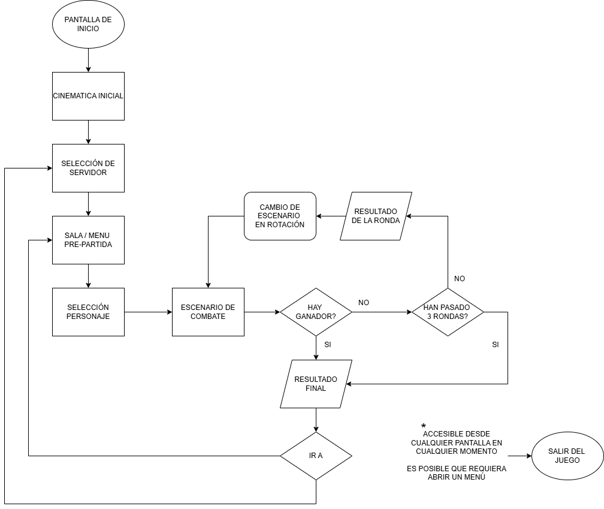

***

## Aspectos Técnicos

## Infraestructura de Red

#### API-REST

La arquitectura del juego implementa un **servidor robusto** que gestiona la lógica y el estado de las partidas. La comunicación entre cliente y servidor se realiza mediante una **API REST** que utiliza correctamente los verbos HTTP:

- **GET**: Obtención de datos (perfiles de usuarios, leaderboard, estado de salas, inicio sesión)
- **POST**: Creación de recursos (registro de usuarios)
- **PUT**: Actualización de datos (puntuaciones, datos de perfil, actualizar leaderboard)
- **DELETE**: Eliminación de recursos (borrado de usuarios, cierre de sesiones)

El sistema gestiona usuarios con un sistema de login, a base de un _nickname_ único y una contraseña, almacenando además de las credenciales, datos adicionales del jugador como:

- **Número de Victorias** del usuario alcanzadas entre todas las partidas
- **Último Personaje Usado** del usuario basado en su anterior partida
- **Registro del mejor tiempo** del usuario

El servidor monitorea constantemente las **conexiones y desconexiones** tanto en el lado del servidor como en el de los clientes, asegurando la consistencia del estado de la partida y reaccionando adecuadamente ante caídas de conexión. Implementa un **sistema de logging completo para depuración**, permitiendo un rastreo detallado de eventos del juego.

El **manejo de errores** es robusto, con _fallbacks_ y pantallas intermediarias cuando el servidor se cae o hay problemas de conexión, garantizando que los jugadores reciban _feedback_ claro sobre el estado de la partida.

Las partidas con datos almacenados sólo están disponibles en los modos online **(Online single y Online Multi)**, el local single no requiere de registro y no almacena datos.

#### WebSockets

Para la experiencia multijugador, el juego utiliza **WebSockets** que permiten comunicación bidireccional en tiempo real entre cliente y servidor:

- **Sincronización instantánea de movimientos**: Cada acción del jugador (movimiento de casilla, activación de habilidad) se transmite y se refleja para todos los clientes conectados
- **Actualización de estado en vivo**: La vida, puntuación, y posición de cada jugador se actualiza instantáneamente para todos los los clientes conectados
- **Detección de victoria/derrota**: El servidor asegura que se cumplen las condiciones de victoria y derrota, y comunica el resultado a todos los clientes de forma sincronizada
- **Transmisión de inputs de teclado**: Cada imput del jugador se envía a través de WebSockets y se procesa en el servidor, asegurando controles iguales entre jugadores y sincronización estable.
- **Sincronización de eventos dinámicos**: Los eventos del mapa e interacciones (desaparición de tiles, efectos especiales de las habilidades de personajes) se sincronizan entre todos los clientes conectados, garantizando que todos los jugadores vean el mismo estado del mapa en todo momento.

Para jugar un partida online, primero un jugador debera iniciar sesión y selecciónar 'Online Multi', y abrir en su navegador 'localhost:nPuerto'; tras esto el otro jugador abrira en su navegador 'ipDelHost:nPuerto', e iniciara sesión y selecciónara 'Online Multi', esto iniciara la pantalla de selección tras la cual los jugadores podran empezar a jugar. La partida se podra abandonar en cualquier momento pulsando el botón X, abajo a la izquierda en la pantalla del nivel. Al hacerlo, saltará una pantalla de aviso para el otro jugador y la partida se interrumpirá. No se puede regresar a una partida interrumpida y no se procesan datos de esta.

###

***
## Imagen y Diseño Visual
#### Descripción Visual
El estilo visual es caricaturesco, 2D. Cada apartado contiene sus respectivos bocetos.
##### Personajes:
Los personajes representan parodias de los grupos musculares generalmente entrenados por los culturistas: *Pierna*, *brazo*, *core* y *Mewing* (tener una mandíbula más marcada). 
Cada personaje tiene un color asociado: *pierna-rojo, brazo-azul, core-verde, mewing-amarillo.*

 ##### Pantallas principales:
***Menú inicial***: Título, iniciar juego, tutorial y créditos.  
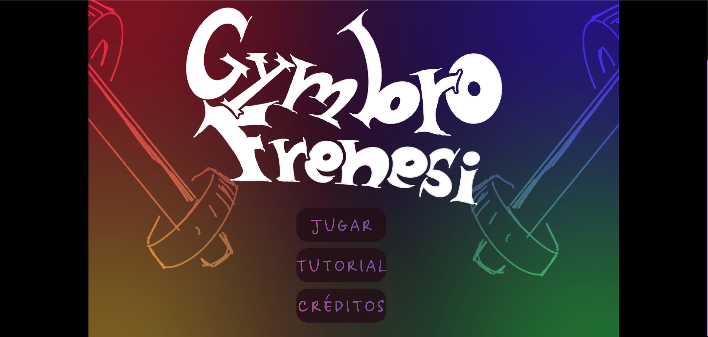

***Pantalla tutorial***: consta de una pantalla principal con los controles y mecánicas globales, y luego un menú de selección que permite visualizar info extra de cada personaje.
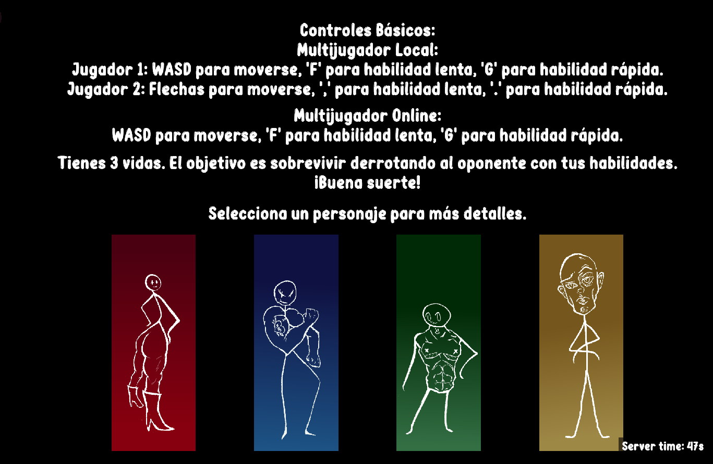

***Pantalla de registro***: Permite seleccionar el modo de juego, y gestionar las cuentas.
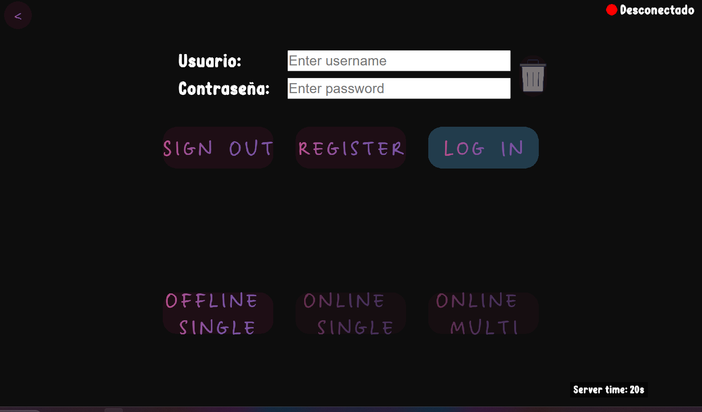
***Sala emparejamiento***: Pantalla básica de espera exclusiva de multijugador online que permanece hasta que se conecten dos jugadores diferentes. 

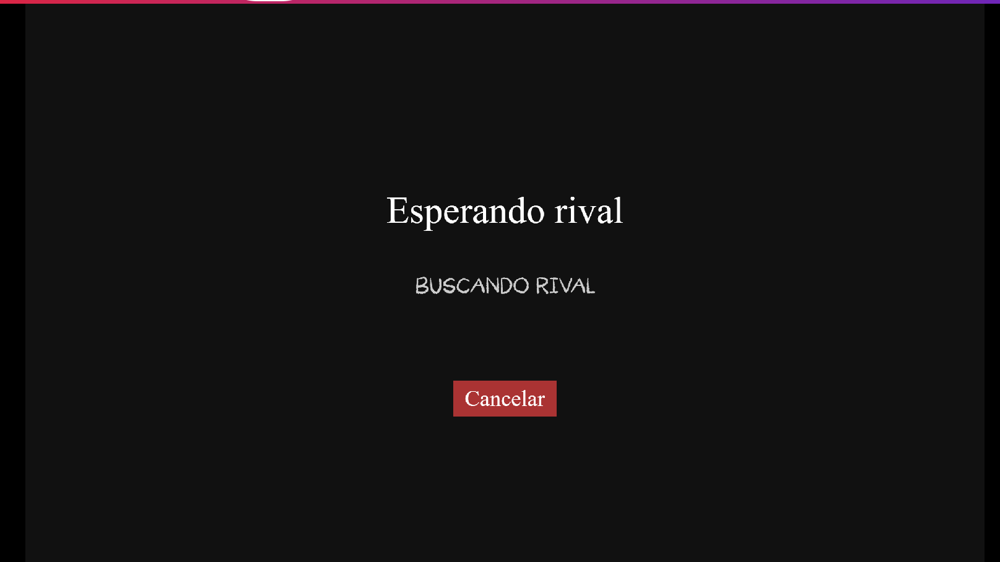
***Selección de personajes***: Aparecerán los 4 personajes elegibles. El jugador puede pinchar para seleccionar el suyo. Los personajes seleccionados se bloquearán para el resto. 
 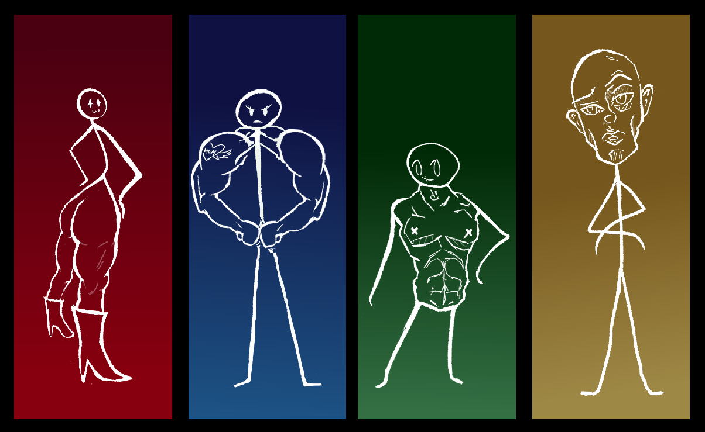

***Escenario***: 
El escenario principal es la *encimera*.

Los escenarios se compondrán por la cuadrícula principal (interacción), menos detallados para priorizar la visibilidad y bordes decorativos temáticos (no interactuables).
 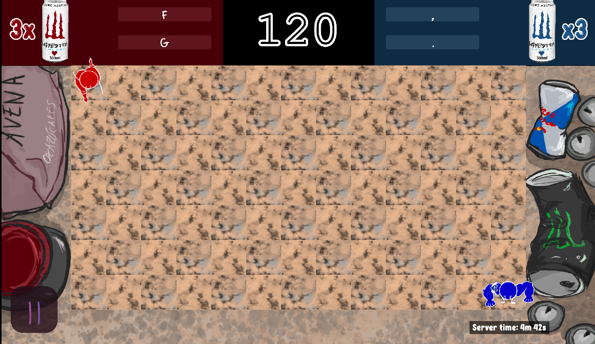

***Puntuación final***: Según el personaje ganador, aparecerá un fondo especial junto con el nombre del player ganador (en modo multijugador, el nickname).  
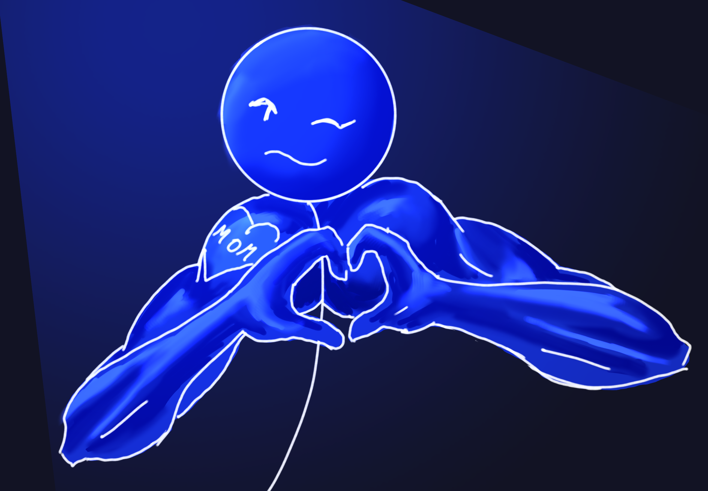
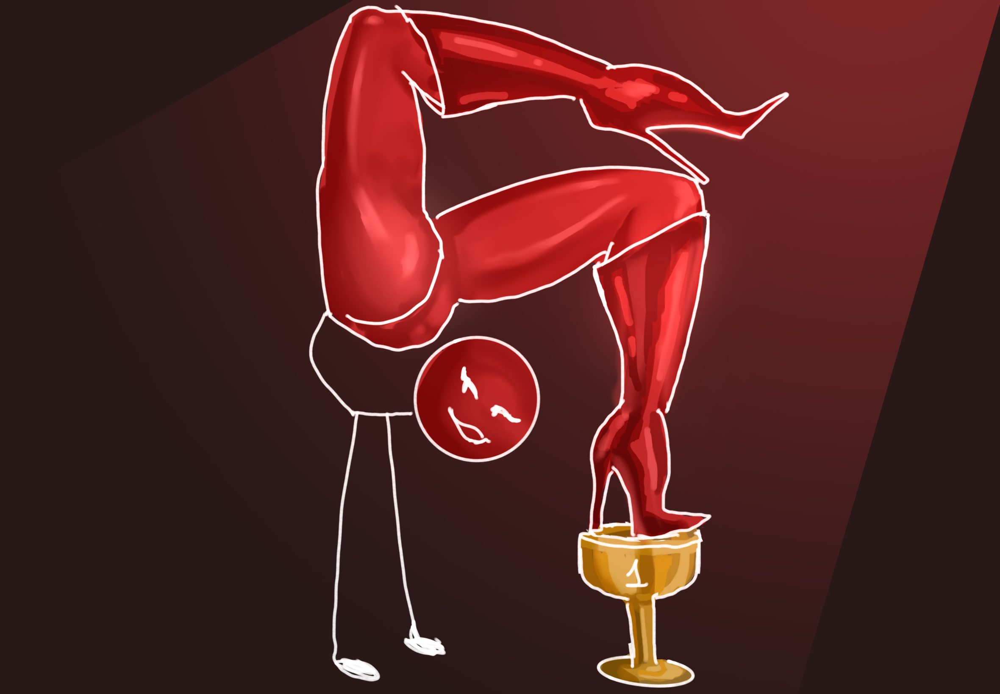
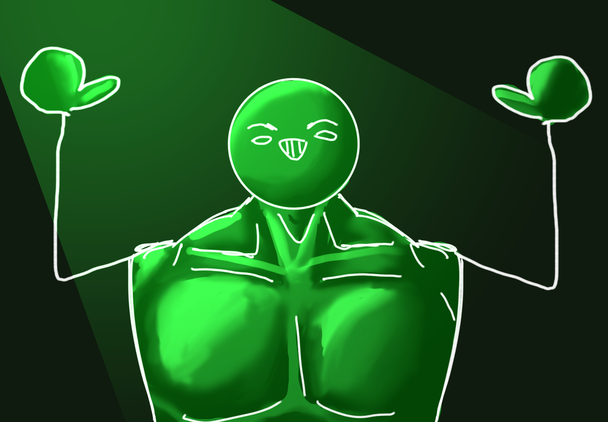
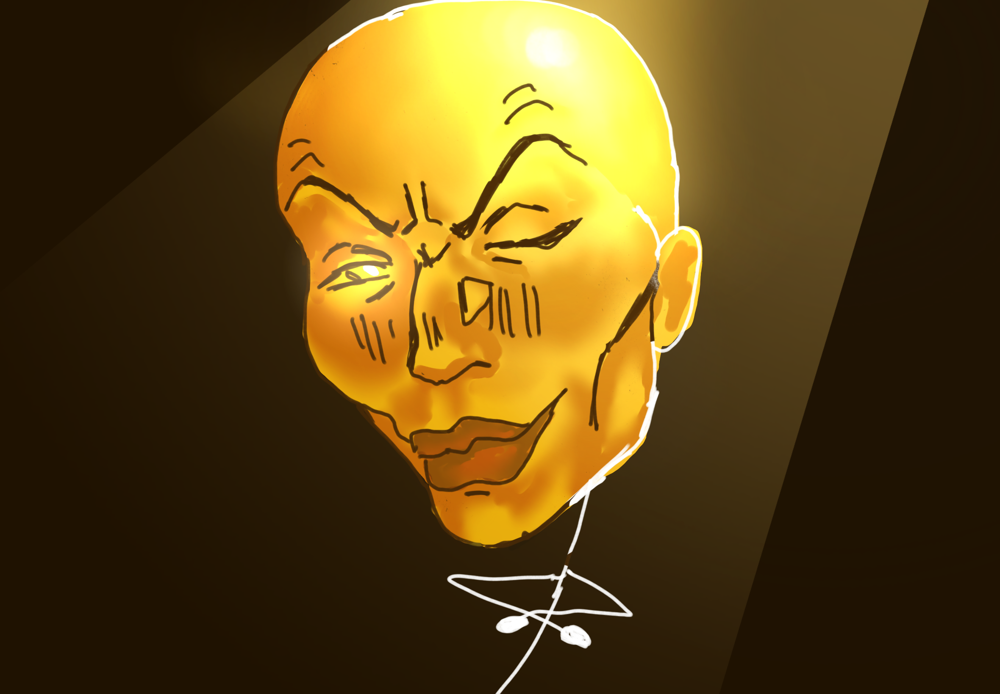
#

#### Logotipo
El diseño está inspirado en la hermandad que se forma entre los entusiastas del gimnasio. Las siglas GF coinciden con el nombre del juego.

**Logo con fondo transparente**

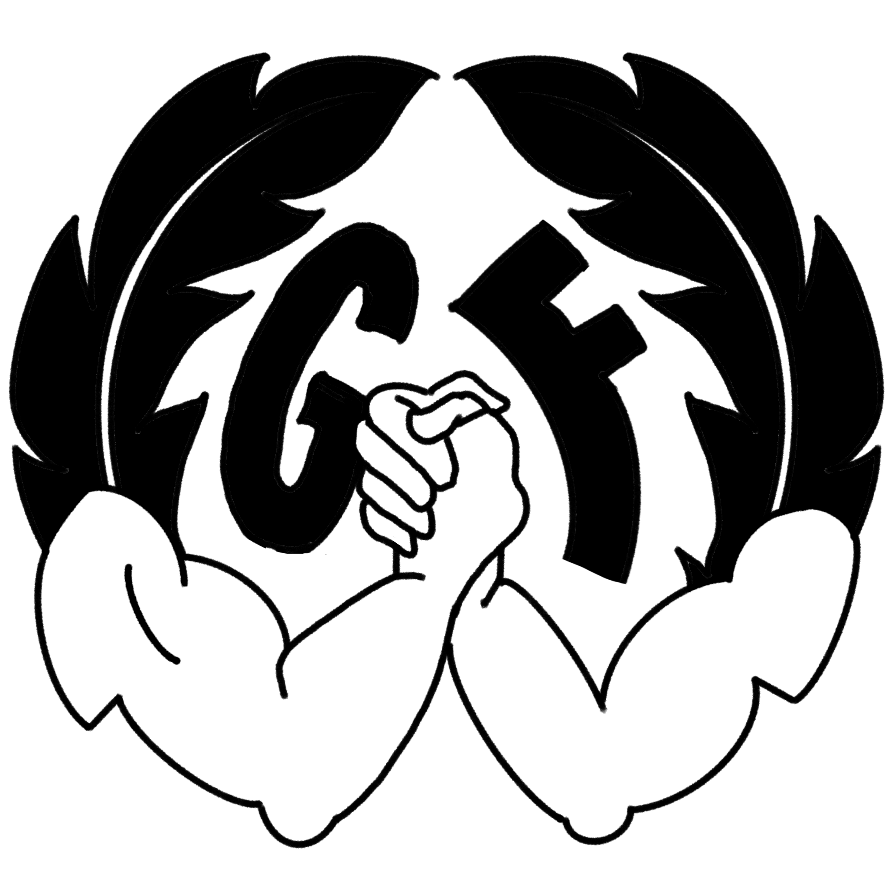

**Logo con fondo opaco**
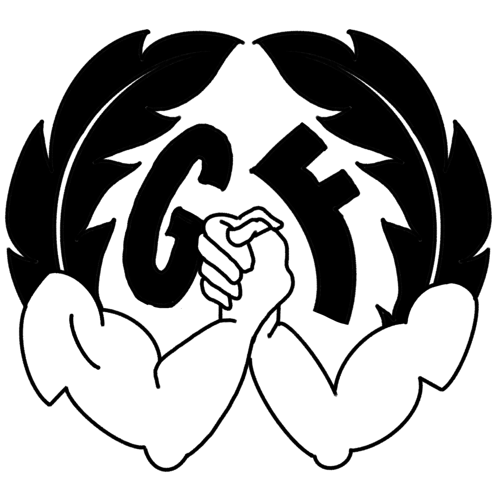

#### Inspiración
Páginas Web antiguas basadas en juegos de Adobe Flash, por ejemplo, Friv. 

***Juegos de referencia***

*[Womp-a-thon ](https://www.mariowiki.com/Whomp-a-thon)*  

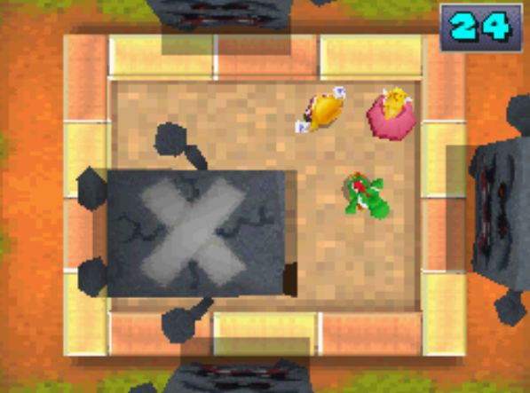

*[Electriman](https://electricman.fandom.com/wiki/Electric_Man)*  

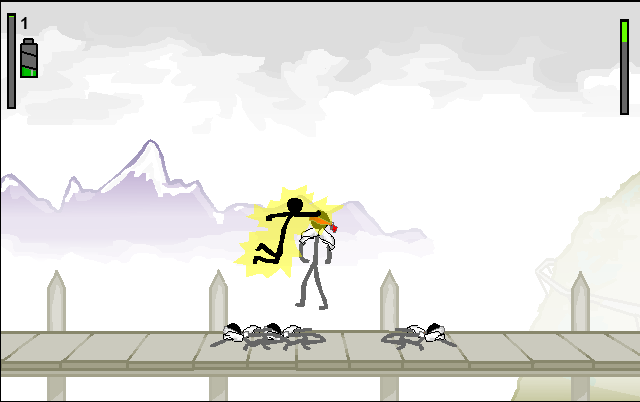

*[Minecraft TNT run](https://mcserversminigames.fandom.com/wiki/TNT_Run)*  

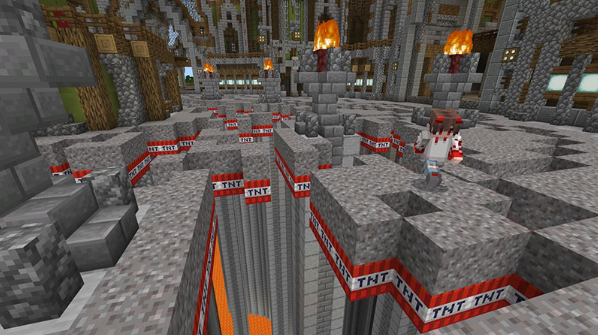

*[FallGuys Hex-A-Gone](https://fallguysultimateknockout.fandom.com/wiki/Hex-A-Gone)*  

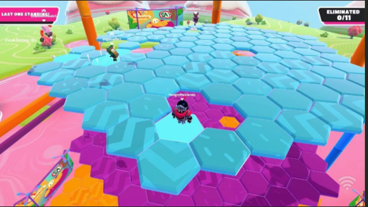

***
## Jugabilidad
#### Objetivo del juego
El objetivo del juego consta en **sobrevivir la rondas con la mayor cantidad de vidas**. 
Para asegurar la victoria, los jugadores pueden usar sus habilidades para empujar a otros jugadores y quitarles vidas; o sobrevivir el tiempo suficiente sin caerse a los huecos.  

*Si uno de los jugadores muere antes de que acabe el tiempo, el que quede será el ganador*
*Si el tiempo se acaba, la victoria se asignará al jugador con más número de vidas*
*Si varios jugadores llegan al final con el mismo número de vidas, habrá un empate.*

#### Controles
No se permite el movimiento diagonal. El movimiento es por casillas en las cuatro direcciones dentro del límite del mapa.  

Movimiento general:

 **W** – Movimiento hacia arriba 

 **A** – Movimiento hacia la izquierda 

 **S** – Movimiento hacia abajo 

 **D** – Movimiento hacia la derecha  

**F**- Activar habilidad rápida del personaje. 

**G**- Activar habilidad lenta del personaje. 

En caso de juego local:

Movimiento general (J1)

Movimiento (J2)
- **⬅⬆⬇⮕** - Movimiento básico.
- **,** - Habilidad rápida.
- **.** - Habilidad lenta.

#### Mecánicas y Físicas
##### Físicas del escenario: 
El escenario está compuesto por una *cuadrícula estática*. 
Las baldosas de la cuadrícula irán desapareciendo poco a poco durante la partida, creando agujeros por los que los jugadores se podrán caer, lo que les hará perder una vida. Antes de caerse, la baldosa temblará unos segundos para avisar al jugador. 

##### Tiempo límite:
Cada ronda tiene un tiempo máximo de duración de *2:00* minutos. Cuando este tiempo se termina, la ronda acabará.  

##### Vidas: 
Cada jugador tiene *tres vidas* al principio de la partida. Estas vidas no se pueden recuperar. 
Cuando un jugador pierde todas sus vidas se termina la ronda.  

##### Reaparición de personajes:
Si el jugador aún tiene vidas, aparecerá en el mapa en una casilla válida (sin agujero y no ocupada por un jugador) aleatoria. 

##### Movimiento básico:
Los jugadores se moverán en líneas rectas a través del escenario. Moviendose de casilla a casilla.

##### Elección de personajes: 
Los jugadores pueden elegir sus personajes desde un menú. Los personajes no elegidos no aparecen en la partida. Los jugadores no pueden repetir personaje. El número máximo de jugadores está limitado a 2 (con los controles del teclado en local).

##### Habilidades personajes: 
Cada personaje tiene mecánicas únicas además del movimiento básico. Las habilidades se recargan cada cierto tiempo (depende de la habilidad). Habrá recarga rápida (6 seg), y recarga lenta (12 seg). 

**Personaje 1: Piernas –(movimiento)–** 

***Hab 1 / recarga rápida***: El jugador podrá saltar sobre el espacio de una casilla (incluídos huecos) en la dirección en la que está mirando.  

***Hab 2 /recarga lenta***: El jugador podrá saltar por encima de una casilla (incluídos huecos) y otros jugadores en la dirección en la que está mirando. 
 

**Personaje 2: Brazos –(atacante)–**  

***Hab 1 /  recarga rápida***: Empuja a los enemigos una casilla en la dirección en la que avanza el personaje, haciendo que pueda tirar a otros jugadores a cualquier agujero que haya entre medias si se da el caso. El personaje jugador no se mueve de su posición. 

***Hab 2 / recarga lenta***: Lo mismo que la rápida, pero el empuje es de 2 casillas en vez de 1 casilla. 
 

 
***Jugador 3: Pecho / Abdominales - (defensivo)-***  

***Hab 1 /  recarga rápida***: El personaje carga en línea recta (en la dirección hacia donde esté mirando) empujando a un personaje hacia los laterales de su trayectoria, pudiendo tirarlo al vacío, o chocandose con una pared del escenario si no hay otro jugador en su camino. Cuando impacta con dicho otro jugador, su impulso se detiene. Sin embargo, se caera si hay un agujero en su trayectoria.

***Hab 2 / recarga lenta***: El personaje carga en línea recta (en la dirección hacia donde esté mirand) empujando a un personaje hacia los laterales de su trayectoria, pudiendo tirarlo al vacío, o chocandose con una pared del escenario si no hay otro jugador en su camino. Cuando impacta con dicho otro jugador, su impulso se detiene. No se caera si hay un agujero en su camino, excepto si la última casilla no es valida, en cuyo caso el jugador se caerá al vacío. 
 
***Jugador 4: Barbilla / Mentón – (comodín***):
 No tiene habilidades especiales de movimiento, su función es confundir, despistar y parasitar a sus compañeros. 

***Hab 1 /  recarga rápida***: produce un destello alrededor del otro jugador que le impide ver con claridad las 8 casillas adyacentes a sí durante un par de segundos.  

***Hab 2 / recarga lenta***: produce un destello alrededor del otro jugador que le impide ver con claridad las 24 casillas adyacentes a sí durante un par de segundos.

(La siguiente tabla explicativa se encuentra desactualizada, pero se deja por la comodidad del lector y para ayudar a entender las habilidades).

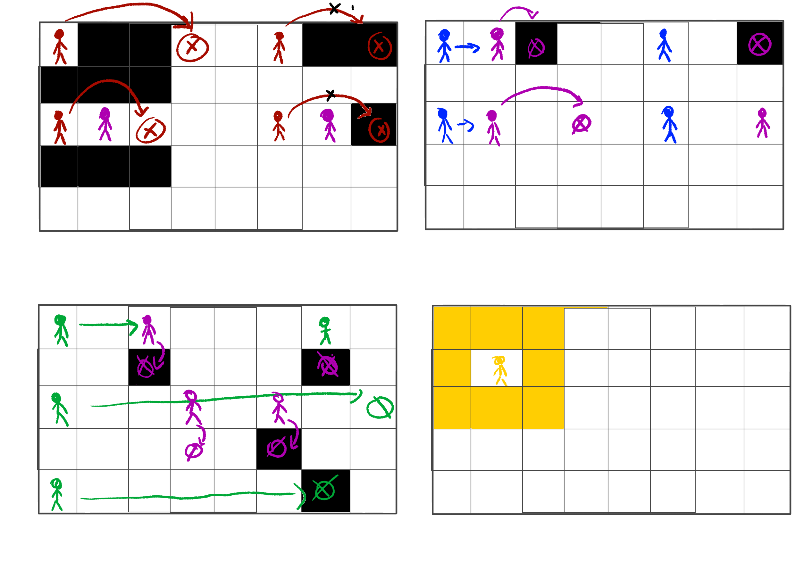
***

## Narrativa
El protagonista de la historia será un joven entusiasta del gimnasio genérico que vuelve a casa para tomarse un nuevo batido de proteínas que se ha comprado en una página web sospechosa. Al tomárselo, caerá al suelo desmayado y a medida que pasa el tiempo sus partes del cuerpo se separaran milagrosamente en brazos, piernas, faja abdominal y postura lingual (barbilla y el mentón).  

Estas partes del cuerpo se baten en duelo entre ellas en la cocina del protagonista para demostrar la supremacía de sus entrenamientos y ver quien es mejor. En el proceso, van destrozando la cocina del joven entusiasta, y deberán evitar caerse por los huecos. 

Al final de la partida, las partes del cuerpo se unen nuevamente, aquel que gana la partida se alza con la supremacía sobre los demás y el joven entusiasta decide petarse a ejercicios localizados a esa zona. 

*Esta historia no ha podido ser implementada visualmente de momento.*

***

## Sonido
#### Música
La banda sonora será de estilo 8 bits imitando el estilo arcade tradicional. La canción final es una parodia del estilo phonk relacionado a los gymbros paródicamente.

#### Efectos sonoros:
- Golpes
- Uso de habilidades

***
## Marketing
Estrategia: promover el juego a través de Redes Sociales *(p.ej: Instagram, YouTube, Tiktok)*, aprovechando además la reciente tendencia que son los juegos de socialización como *Peak*, o *Lethal Company*. 
Además, tendremos una demo gratuita con el modo local para recibir feedback e interacción.
Por último, haremos colaboraciones con creadores de contenidos para atraer a sus espectadores hacia nuestro juego. 
***
***
## Links:
**Itchio**: https://catherinenekoro.itch.io/gymbro-frenesi
**Newgrounds**: https://www.newgrounds.com/portal/view/1036639
**Gamejolt**: https://gamejolt.com/games/gymbrofrenesi/1076360

***
***
## Créditos

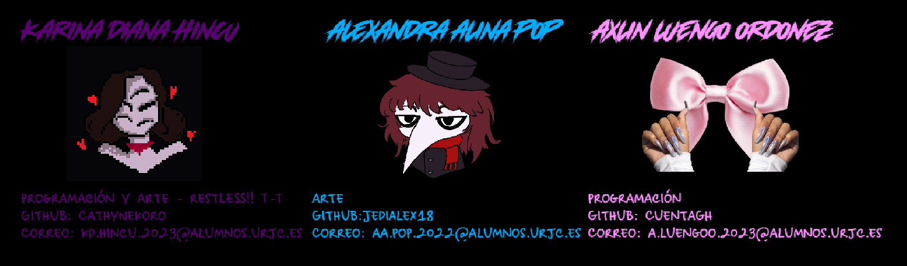

#### GRUPO 9: GYMBRO FRENESI

**KARINA DIANA HINCU**

**AXLIN LUENGO ORDÓÑEZ**

**ALEXANDRA ALINA POP**

Fuentes: 

 Something-exquisite-caps: anasfonts 

Curiosness DEMO: bogstav 

Horsemen Demo: The Branded Quotes 

Ironik_rotis: Estelle Flores 

Bubble Bobble:  Almarkhatype ;

GunnerGraffiti-Regular: Fitrah Type"

Música:

Intro: 'I Love My 8-bit Game Console' - DJARTMUSIC 

Partida: 'Retro Arcade Game Music'- MondaMusic 

Pantalla final: 'Phonk Edit'- SolarFLEX

***
***
## Bibliografía
*[Womp-a-thon ](https://www.mariowiki.com/Whomp-a-thon)*
*[Electriman](https://electricman.fandom.com/wiki/Electric_Man)*
*[Minecraft TNT run](https://mcserversminigames.fandom.com/wiki/TNT_Run)*
*[FallGuys Hex-A-Gone](https://fallguysultimateknockout.fandom.com/wiki/Hex-A-Gone)*