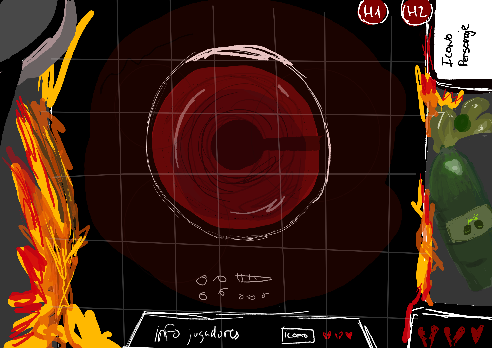
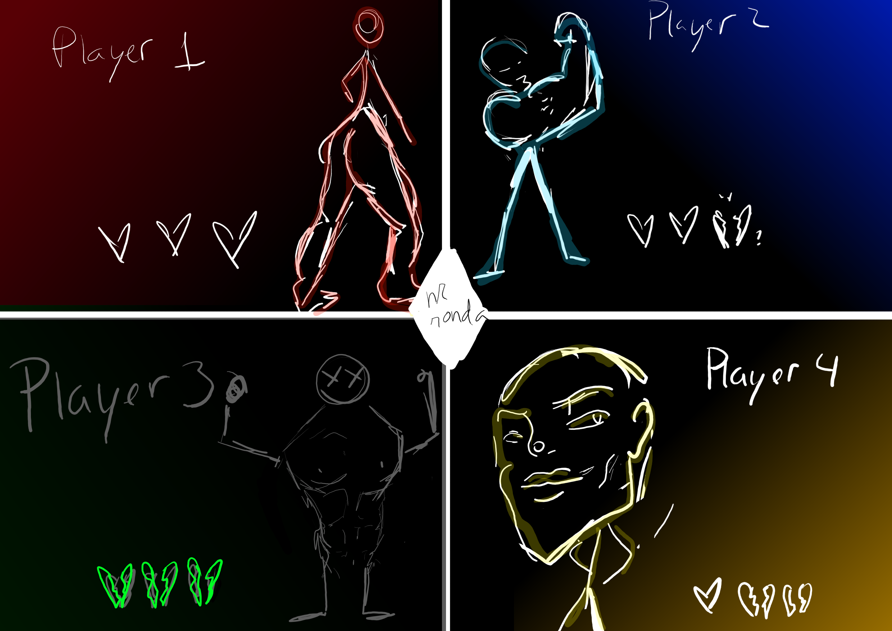
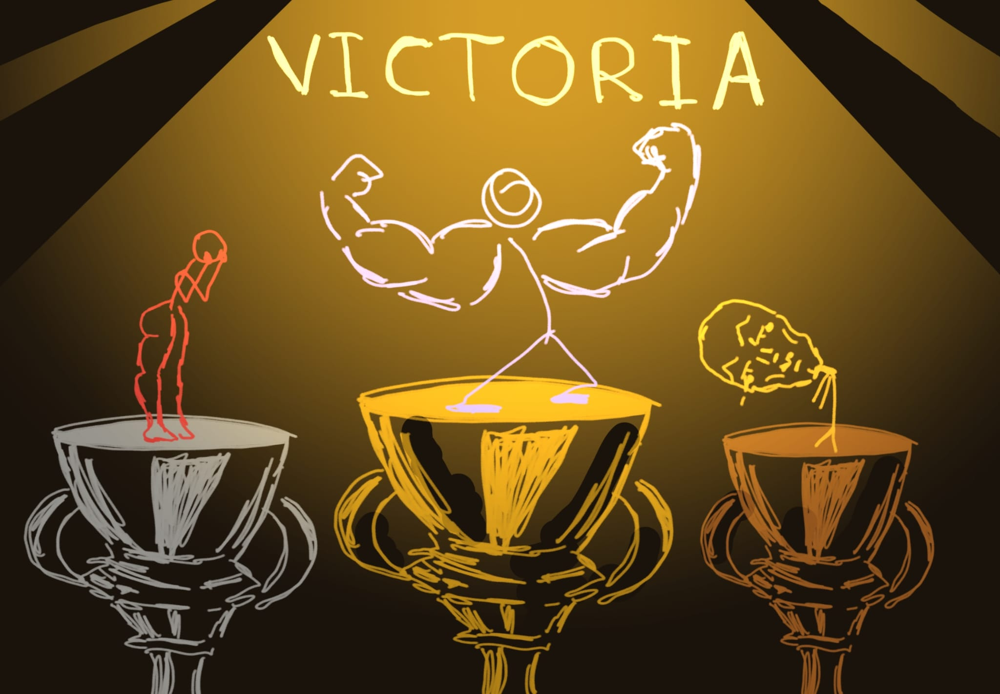

***
***
***
# Cabecera
## Nombre del juego: "GYMBRO FRENESI"
# Descripción de la temática del juego: 
Juego *plataformas* y *pvp*. Adopta una temática inspirada en el culturismo y comedia bizarra.
# Integrantes del equipo de desarollo:
**KARINA DIANA HINCU** 
Correo universidad:*kd.hincu.2023@alumnos.urjc.es* 
Github: *CathyNekoro*

**AXLIN LUENGO ORDÓÑEZ**
Correo universidad: *a.luengoo.2023@alumnos.urjc.es*
Github: *CuentaGH*

**ALEXANDRA ALINA POP**
Correo universidad:  *aa.pop.2022@alumnos.urjc.es*
Github:*JediAlex18*
***
***
***
 # GYMBRO FRENESI (GDD)

**1. [Introducción](#introducción)**

**2. [Especificaciones](#especificaciones)** 
- [Género, PO y Plataforma](#género-po-y-plataforma)
- [Diagrama de Flujo](#diagrama-de-flujo)

**3. [Aspectos Técnicos](#aspectos-técnicos)**

**4. [Imagen y Diseño Visual](#imagen-y-diseño-visual)**
- [*Descripción y Estilo Visual*](#descripción-visual) 
- [Logotipo](#logotipo) 
- [*Inspiración*](#inspiración) 

**5. [Jugabilidad](#jugabilidad)**
- [*Objetivo del Juego*](#objetivo-del-juego) 
- [*Controles*](#controles) 
- [*Mecánicas y Físicas*](#mecánicas-y-físicas) 
  

**6. [Narrativa](#narrativa)**

**7. [Sonido](#sonido)** 

- [Música](#música)

-  [Efectos Sonoros](#efectos-sonoros) 

**8.[Marketing](#marketing)**

**9.[Créditos](#créditos)** 

**10.[Bibliografía](#bibliografía)** 

***

## Introducción
Este documento pretende presentar los aspectos fundamentales del desarrollo del videojuego ***Gymbro Frenesi*** para la asignatura de Juegos en Red. En este GDD solo se detalla información sobre el juego, no sobre el funcionamiento en línea que será agregado a futuro.
***

## Especificaciones
####   Género, PO y Plataforma

***Gymbro Frenesi*** pertenece al género *plataformas*, *pvp* y *juego de socialización*. 

Nuestro público objetivo son jugadores de *edad adolescente en adelante*, aunque hay referencias a la cultura pop más orientadas hacia los jóvenes.
Secundariamente queremos apelar a los fans de Nintendo que estén insastisfechos con la compañía debido a las recientes y no tan recientes prácticas anti-consumidores. Por ello hemos elegido un juego reconocido de una de sus sagas principales para darle una reinterpretación paródica. 

El juego está diseñado para ***Ordenadores / PC***. 

####  Diagrama de Flujo

***

## Aspectos Técnicos
Cámara 2D al estilo de “Vista de Pájaro”.

***
## Imagen y Diseño Visual
#### Descripción Visual
El estilo visual es caricaturesco, 2D. Cada apartado contiene sus respectivos bocetos.
##### Personajes:
Los personajes representan parodias de los grupos musculares generalmente entrenados por los culturistas: *Pierna*, *brazo*, *faja abdominal* y un entrenamiento reciente relativamente popular: *postura lingual* (para tener una mandíbula más marcada). 
Cada personaje tiene un color asociado: *pierna-rojo, brazo-azul, torso-verde, postura lingual- amarillo.*

*Diseño de los personajes en el menú de selección.*

##### Escenario: 
Los escenarios se ambientan en lugares comunes de la cocina (que es donde ocurren las peleas según la historia): *encimera*, *congelador* y *vitrocerámica*. 
(Los multiples escenarios serán implementados a la hora de implementar el servicio de multijugador a través de un servidor).

Los escenarios se compondrán por la cuadrícula del escenario, menos detallados para priorizar la visibilidad y bordes decorativos temáticos según la ronda.

 

 

 
 El escenario estará quemándose por los bordes (animado). Para aumentar la dificultad se pondera la idea de añadir un efecto visual de distorsión por calor.

 ##### Pantallas secundarias:
***Menú inicial***: Título, iniciar juego, créditos, salir.  

***Selección de servidor***: Pantalla básica que mostrará los servidores disponibles o pedirá un código de acceso a la sala, dependiendo del método que usemos. 
***Selección de personajes***: Aparecerán los 4 personajes elegibles. El jugador puede pinchar para seleccionar el suyo. Los personajes seleccionados se bloquearán para el resto. 

 

***Cinemática inicial***: estilo tira de comic/ intro de las chicas superpoderosas.  

***Puntuación entre rondas***: pantalla partida con el número de jugadores que estén participando. Los jugadores muertos aparecerán con un filtro blanco- negro. 
(La pantalla de puntuación entre rondas será implementada a la hora de implementar el servicio de multijugador a través de un servidor).

 

***Puntuación final***: El dibujo del personaje ganador sobrepuesto sobre un fondo de podio.  

#

#### Logotipo
El diseño está inspirado en la hermandad que se forma entre los entusiastas del gimnasio. Las siglas GF coinciden con el nombre del juego.

**Logo con fondo transparente**

**Logo con fondo opaco**

#### Inspiración
Páginas Web antiguas basadas en juegos de Adobe Flash, por ejemplo, Friv. 

***Juegos de referencia***

*[Womp-a-thon ](https://www.mariowiki.com/Whomp-a-thon)*  

*[Electriman](https://electricman.fandom.com/wiki/Electric_Man)*  

*[Minecraft TNT run](https://mcserversminigames.fandom.com/wiki/TNT_Run)*  

*[FallGuys Hex-A-Gone](https://fallguysultimateknockout.fandom.com/wiki/Hex-A-Gone)*  

***
## Jugabilidad
#### Objetivo del juego
El objetivo del juego consta en **sobrevivir la rondas con la mayor cantidad de vidas**. 
*El jugador con más vidas restantes que consiga llegar al final gana.* 
Para asegurar la victoria, los jugadores pueden usar sus habilidades para empujar a otros jugadores fuera del mapa y quitarles vida.  

*Si los jugadores pierden todas sus vidas antes de completar las tres rondas, todos pierden.*  

*Si varios jugadores llegan al final con el mismo número de vidas, habrá un empate.*

(La jugabilidad de multiples rondas será implementada a la hora de implementar el servicio de multijugador a través de un servidor).

#### Controles
No se permite el movimiento diagonal. El movimiento es por casillas.  

Movimiento general:

 **W** – Movimiento hacia arriba 

 **A** – Movimiento hacia la izquierda 

 **S** – Movimiento hacia abajo 

 **D** – Movimiento hacia la derecha  

**F**- Activar habilidad rápida del personaje. 

**G**- Activar habilidad lenta del personaje. 

En caso de juego local, se plantean 2 opciones de controles para cada jugador:

Teclado: capacidad para 2 jugadores.

Movimiento general (J1)

Movimiento (J2)
- **⬅⬆⬇⮕** - Movimiento básico.
- **,** - Habilidad rápida.
- **.** - Habilidad lenta.

Movimiento (J3-J4)
(Los jugadores 3 y 4 serán implementados a la hora de implementar el servicio de multijugador a través de un servidor).

Mando: (según la implementación de la librería se hará el mapeado de una forma u otra para los mandos)
Si no hay ningún mando conectado, el máximo de jugadores será de 2. Si se detecta un mando el límite aumenta por cada mando metido. No hace falta que estén el número máximo de jugadores siempre en la partida (por ejemplo uno de los jugadores prefiere usar mando y no teclado)
(La implementación del uso de uno o varios mandos aun no es definitiva, en caso de abordarla su implementación vendra a la hora de implementar el servicio de multijugador a través de un servidor).

#### Mecánicas y Físicas
##### Físicas del escenario: 
El escenario está compuesto por una *cuadrícula cuyo tamaño variará según el número de jugadores*. 
Las baldosas de la cuadrícula irán desapareciendo poco a poco durante la partida, creando agujeros por los que los jugadores se podrán caer, lo que les hará perder. Antes de caerse, la baldosa temblará unos segundos para avisar al jugador. 

##### Tiempo límite:
Cada ronda tiene un tiempo máximo de duración de *2:00* minutos. Cuando este tiempo se termina, el escenario cambiará a uno más desafiante. 

##### Diferentes escenarios:
Cada ronda consta de un escenario diferente.	
***Ronda 1***: Encimera. Ningún efecto especial.  

***Ronda 2***: Congelador. Suelo resbaladizo.  

***Ronda 3***:  Vitrocerámica. Si el jugador se queda quieto más de 5 segundos se quema y pierde una vida. 

(Como se menciona anteriormente, la jugabilidad de multiples rondas será implementada a la hora de implementar el servicio de multijugador a través de un servidor).

##### Vidas: 
Cada jugador tiene *tres vidas* al principio de la partida. Estas vidas no se pueden recuperar. 
Cuando un jugador pierde todas sus vidas, no podrá reaparecer en las siguientes rondas. El número de vidas restantes al final de la partida determinarán la victoria. 

##### Reaparición de personajes:
Al principio de cada nivel, si el jugador aún tiene vidas, aparecerá en el mapa en una casilla válida (sin agujero y no ocupada por un jugador). 

El jugador reaparecerá en una posición aleatoria del mapa. Para asegurar que el jugador no queda atrapado, se creará una plataforma cuadrada alrededor del lugar donde ha aparecido. 

##### Movimiento básico:
Los jugadores se moverán en líneas rectas a través del escenario. Moviendose de casilla a casilla.

##### Elección de personajes: 
Los jugadores pueden elegir sus personajes desde un menú. Los personajes no elegidos no aparecen en la partida. Los jugadores no pueden repetir personaje. En las partidas locales, el número máximo de jugadores está limitado a 2 (con los controles del teclado). Por cada mando conectado el límite aumenta en 1 (hasta el máximo de 4).
(Como se menciona anteriormente, la implementación del uso de uno o varios mandos aun no es definitiva, en caso de abordarla su implementación vendra a la hora de implementar el servicio de multijugador a través de un servidor).

##### Habilidades personajes: 
Cada personaje tiene mecánicas únicas además del movimiento básico. Las habilidades se recargan cada cierto tiempo (depende de la habilidad). Habrá recarga rápida (6 seg), y recarga lenta (12 seg). 

**Personaje 1: Piernas –(movimiento)–** 

***Hab 1 / recarga rápida***: El jugador podrá saltar una distancia de dos casillas en la dirección en la que está mirando.  

***Hab 2 /recarga lenta***: El jugador podrá saltar por encima de otros jugadores una distancia de dos casillas en la dirección en la que está mirando. 
 

**Personaje 2: Brazos –(atacante)–**  

***Hab 1 /  recarga rápida***: Empuja a los enemigos una casilla en la dirección en la que avanza el personaje, haciendo que pueda tirar a otros jugadores a cualquier agujero que haya entre medias si se da el caso. El personaje jugador no se mueve de su posición. 

***Hab 2 / recarga lenta***: Lo mismo que la rápida, pero el empuje es de 2 casillas en vez de 1 casilla. 
 

 
***Jugador 3: Pecho / Abdominales - (defensivo)-***  

***Hab 1 /  recarga rápida***: El personaje carga en línea recta (hacia donde esté mirando) empujando a un personaje hacia los laterales de su trayectoria, pudiendo tirarlo al vacío, o chocandose con una pared del escenario si no hay otro jugador en su camino. Cuando impacta con dicho otro jugador, su impulso se detiene. Sin embargo, se caera si hay un agujero en su camino.

***Hab 2 / recarga lenta***: El personaje carga en línea recta (hacia donde esté mirando) empujando a un personaje hacia los laterales de su trayectoria, pudiendo tirarlo al vacío, o chocandose con una pared del escenario si no hay otro jugador en su camino. Cuando impacta con dicho otro jugador, su impulso se detiene. Pero no se caera si hay un agujero en su camino, excepto si la última casilla no es valida, en cuyo caso el jugador se caerá al vacío. 
 
***Jugador 4: Barbilla / Mentón – (comodín***):
 No tiene habilidades especiales de movimiento, su función es confundir, despistar y parasitar a sus compañeros. 

***Hab 1 /  recarga rápida***: produce un destello alrededor del otro jugador que le impide ver con claridad las 8 casillas adyacentes a sí durante un par de segundos.  

***Hab 2 / recarga lenta***: produce un destello alrededor del otro jugador que le impide ver con claridad las 24 casillas adyacentes a sí durante un par de segundos.

(La siguiente tabla explicativa se encuentra desactualizada, pero se deja por la comodidad del lector y para ayudar a entender las habilidades).

***

## Narrativa
El protagonista de la historia será un joven entusiasta del gimnasio genérico que vuelve a casa para tomarse un nuevo batido de proteínas que se ha comprado en una página web sospechosa. Al tomárselo, caerá al suelo desmayado y a medida que pasa el tiempo sus partes del cuerpo se separaran milagrosamente en brazos, piernas, faja abdominal y postura lingual (barbilla y el mentón).  

Estas partes del cuerpo se baten en duelo entre ellas en la cocina del protagonista para demostrar la supremacía de sus entrenamientos y ver quien es mejor. En el proceso, van destrozando la cocina del joven entusiasta, y deberán evitar caerse por los huecos. 

Al final de la partida, las partes del cuerpo se unen nuevamente, aquel que gana la partida se alza con la supremacía sobre los demás y el joven entusiasta decide petarse a ejercicios localizados a esa zona. 

***

## Sonido
#### Música
La banda sonora será dinámica, adaptada a la acción y combates pertenecientes al estilo del juego, con un toque simplista, adaptado a los juegos clásicos de las páginas de Adobe Flash y el estilo artístico de nuestro juego. Se intentará imitar el estilo de la música de 8 bits.

 

#### Efectos sonoros:
- Golpes
- Saltos 
- Uso de habilidades
- Obstáculos que pasan por pantalla
- La desaparición o caída del escenario

(La música y efectos sonoros serán implementados a la hora de implementar el servicio de multijugador a través de un servidor).

***
## Marketing
Estrategia: promover el juego a través de Redes Sociales *(p.ej: Instagram, YouTube, Tiktok)*, aprovechando además la reciente tendencia que son los juegos de socialización como *Peak*, o *Lethal Company*. 
Además, tendremos una demo gratuita con acceso a 2 de los personajes, en la que podras jugar contra otras personas, siempre y cuando al menos una persona tenga el juego de verdad.
Por último, haremos colaboraciones con creadores de contenidos para atraer a sus espectadores hacia nuestro juego. 
***
***
## Créditos
 

#### GRUPO 9: GYMBRO FRENESI

**KARINA DIANA HINCU**

**AXLIN LUENGO ORDÓÑEZ**

**ALEXANDRA ALINA POP**
***
***
## Bibliografía
*[Womp-a-thon ](https://www.mariowiki.com/Whomp-a-thon)*
*[Electriman](https://electricman.fandom.com/wiki/Electric_Man)*
*[Minecraft TNT run](https://mcserversminigames.fandom.com/wiki/TNT_Run)*
*[FallGuys Hex-A-Gone](https://fallguysultimateknockout.fandom.com/wiki/Hex-A-Gone)*